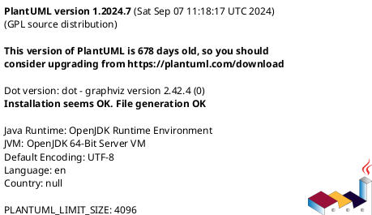
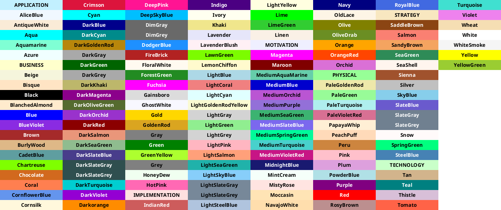
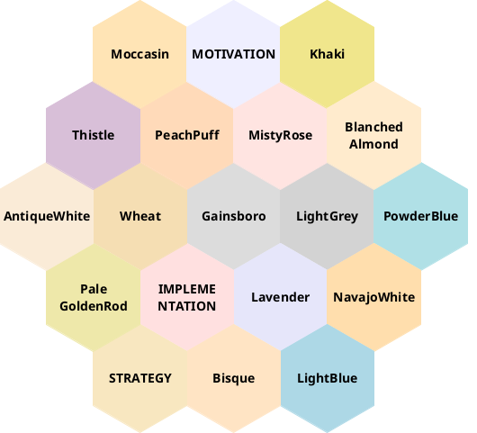

## Basis

## Editoren und Tipps

## eingebaute Grafiken

### PlantUML

Viele grafische Darstellung können mit Hilfe von [PlantUML](https://plantuml.com/) erzeugt werden.
Falls es hier klappt, folgen ein paar Tests:

#### Version

#### Farben

Mehr Informationen über die Verwendung von Farben ist [hier](https://plantuml.com/de/color) hinterlegt.

##### Palette

Die benannten Palette der Farben kann mit dem Befehl `colors` angezeigt werden.

#### Nachbarfarben

Verträgliche Nachbarfarben können mit dem Befehl `colors #FARBNAME#` angezeigt werden.

### Mermaid

### kroki
