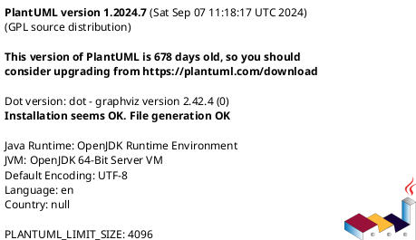
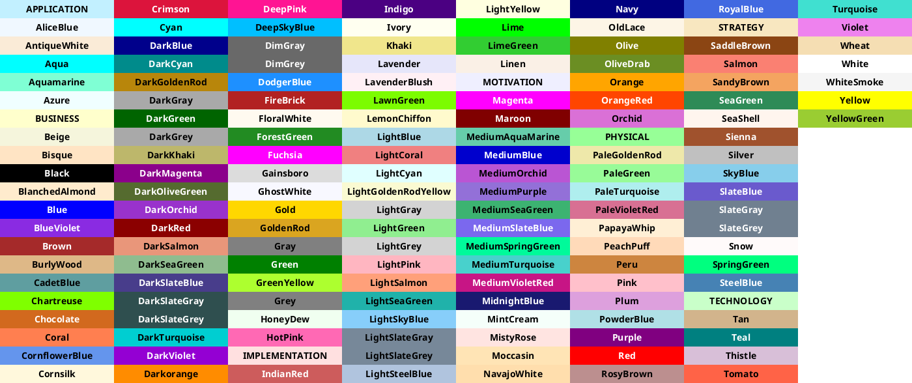
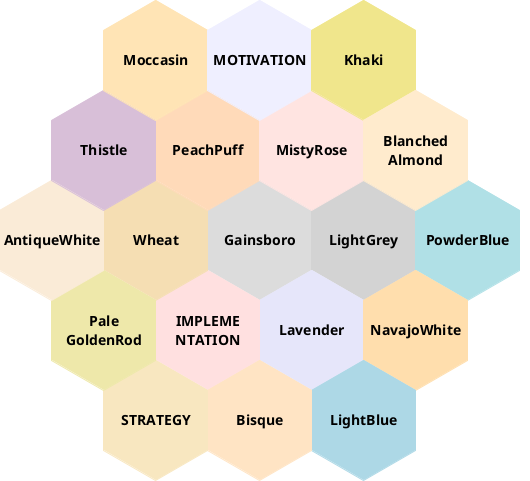

## Basis

## Editoren und Tipps

## eingebaute Grafiken

Gemäß dem [Link](https://docs.github.com/en/get-started/writing-on-github/working-with-advanced-formatting/creating-diagrams) können in GitHub einige Grafiken inline codiert und in der Anzeige gleich dargestellt werden.

### PlantUML

Viele grafische Darstellung können mit Hilfe von [PlantUML](https://plantuml.com/) erzeugt werden.
Falls es hier klappt, folgen ein paar Tests:

#### Version



#### Farben

Mehr Informationen über die Verwendung von Farben ist [hier](https://plantuml.com/de/color) hinterlegt.

##### Palette

Die benannten Palette der Farben kann mit dem Befehl `colors` angezeigt werden.



##### Nachbarfarben

Verträgliche Nachbarfarben können mit dem Befehl `colors #FARBNAME#` angezeigt werden.



### Mermaid

Eine andere Syntax bietet [Mermaid](https://mermaid-js.github.io/mermaid).


### kroki

### GeoJSON and TopoJSON

[GeoTopo]: https://docs.github.com/en/get-started/writing-on-github/working-with-advanced-formatting/creating-diagrams#creating-geojson-and-topojson-maps

Folgend der Beschreibung unter dem [Link][GeoTopo] können auch direkt Karten eingebettet werden.
Mehr zu den jeweiligen Lösungen ist unter den Links [GeoJSON](https://geojson.io/#new&map=14/53.6464/9.7963) und [TopoJSON]() zu finden.

#### GeoJSON-Beispiel

Der VfL Pinneberg ist hier zu finden:

```geojson
{
  "type": "FeatureCollection",
  "features": [
    {
      "type": "Feature",
      "properties": {},
      "geometry": {
        "coordinates": [
          [
            9.806251067456628,
            53.658833344733154
          ],
          [
            9.80614377909555,
            53.65866804100395
          ],
          [
            9.806079406079363,
            53.65836286318478
          ],
          [
            9.80660511904685,
            53.65812762044152
          ],
          [
            9.807066458996928,
            53.65854088384768
          ],
          [
            9.806240338621024,
            53.65884606037801
          ]
        ],
        "type": "LineString"
      }
    }
  ]
}
```
